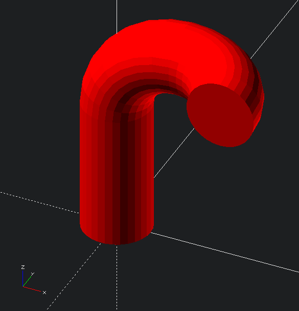
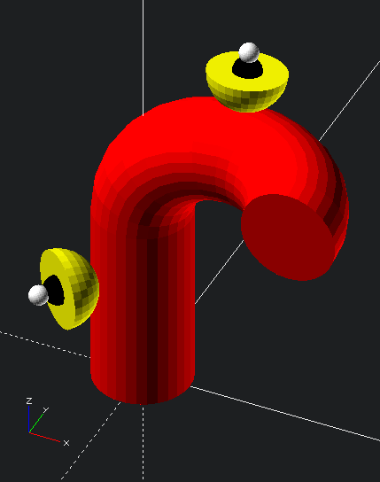
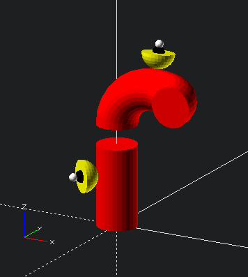

# compound-extrude

CompoundExtrude is a tool that creates a compound extrusion of both straight and curved segments, which all stack end-to-end, and can be applied to any given 2D cross-section. 

Transform-matrices can additionally be generated for any point along the compound extrusion, at any radial distance and orientation w.r.t. to the "center" of the curve (i.e. pointing out from the transform of the origin). So placing additional stuff in relation to a point along the extrusion is simple.

## to install

As far as I know, you just have to put it in the appropriate `OpenSCAD` library directory for your platform. Either just `git clone` directly in there or copy the files.

 - Windows: `My Documents\OpenSCAD\libraries\`
 - Linux: `$HOME/.local/share/OpenSCAD/libraries/`
 - Mac OS X: `$HOME/Documents/OpenSCAD/libraries/`

Restarting `OpenSCAD` is probably a good idea. And `use <foldername/filename.scad>` using relative filepaths from the Library folder seems to work.

Also, make sure that the Library `$PATH` variable is set.

## to use

```scad
use <compound-extrude/compound-extrude.scad>
use <compound-extrude/maths.scad> // matrix mult

// the segment configuration that will be used in these examples
SEGMENTS = [
  // straight segment with [length = 200]
  [200],
  // curved segment with [curveR = 100, curveAng = 90, dirAng = 0]
  [100, 90, 0],
  // curved segment with [curveR = 100, curveAng = 90, dirAng = -90]
  [100, 90, -90]
];
```

To create an extrusion of a circle, with a straight section and a gentle 90° bend along the x-axis, and then another along the -y-axis:
```scad
color("red")
compound_extrude(segments = SEGMENTS)
circle(r = 50);
```



The first thing that `compound_extrude` does is to interally call `summarize_segments(segments)` which both validates the shape of the segments list, and also generates a summary of the segments:
    summary - a list with 5 elements
      
0. A list of `aggTransforms` to the beginnings and ends of each `segment`. The matrix to the beginning of `segment[i]` is `aggTransforms[i]`, and the matrix to the end of `segment[i]` is `aggTransforms[i + 1]`, meaning that `len(aggTransforms) == len(segments) + 1`.
1. A list of individual `segTransforms` which move the `origin` to the end of the `segment`, given that segment starts at the origin. Each segment can be thought of to have it's own local beginning origin, which is identical to the previous segment's ending origin. These individual `segTransforms` can be multiplied together in the correct order to generate the `aggTransforms` from `summary[0]`.
2. `aggSegLengths`, a list of the aggregated lengths before and after each segment (like for `aggTransforms`, we have that `len(aggSegLengths) == len(segments) + 1)`
3. `segLengths`, a list of the lengths of each individual `segment`
4. the input `segments` themseleves (dirty but useful)

`compound_extrude` then applies the transforms to help generate the compound extrusion.

## Use the `summary`

The summary can be generated separately using 
```scad

// generate the summary
summary = summarize_segments(segments = SEGMENTS);

// generally useful
module Tz (z) {
  translate(v = [0, 0, z])children();
};

// something that can be placed alongsed the extrusion
module wart () {
  Tz(z = 40)
  union() {
    color("yellow")
    difference() {
      sphere(r = 40);
      Tz(z = 100)cube(size = 200, center = true);
    };
    color("black")sphere(r = 15);
    Tz(z = 20)color("white")sphere(r = 10);
  };
};
```
Now using the summary, we can place some *warts* on the extrusion
```scad
  union() {
    color("red")
    compound_extrude(segments = SEGMENTS)
    circle(r = 50);
    multmatrix(m = calc_normal_placement_mat(
      summary = summary,
      totLength = 130,
      offset = 50,
      dirAng = 230
    ))
    wart(); 
    multmatrix(m = calc_normal_placement_mat(
      summary = summary,
      totLength = 360,
      offset = 50,
      dirAng = 170
    ))
    wart(); 
  };
```



## More

And then there is more stuff. Any 2D cross-section works, not just a circle, and you can modify `the summary[0] == aggTransforms`
```scad
  zTran = 50;
  zTranMat = [
    [1, 0, 0, 0],
    [0, 1, 0, 0],
    [0, 0, 1, zTran],
    [0, 0, 0, 1],
  ];
  modifiedSummary = [
    [
      summary[0][0],
      mat4_mult_mat4(zTranMat, summary[0][1]), // z + 50
      mat4_mult_mat4(zTranMat, summary[0][2]), // z + 50
      mat4_mult_mat4(zTranMat, summary[0][3])  // z + 50
    ],
    summary[1], summary[2], summary[3], summary[4],
  ];

  union() {
    color("red")
    compound_extrude(
      segments = SEGMENTS,
      summary = modifiedSummary
    )
    circle(r = 50);
    multmatrix(m = calc_normal_placement_mat(
      summary = modifiedSummary,
      totLength = 130,
      offset = 50,
      dirAng = 230
    ))
    wart(); 
    multmatrix(m = calc_normal_placement_mat(
      summary = modifiedSummary,
      totLength = 360,
      offset = 50,
      dirAng = 170
    ))
    wart(); 
  };
```


Find some more stuff in `examples.scad`
